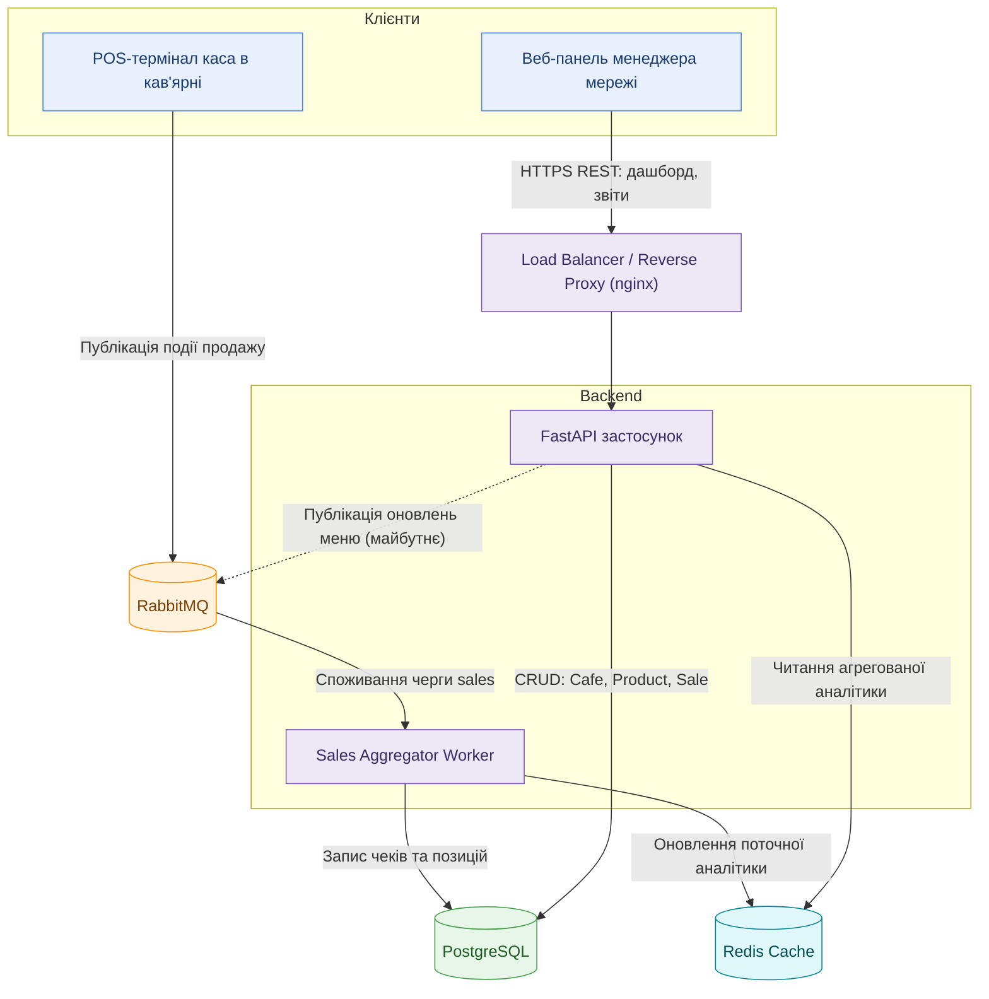

# Хмарна каса для мережі кав'ярень

## Обґрунтування вибору предметної області

Обрана предметна область — **Хмарна каса (SaaS) для мережі невеликих кав'ярень з агрегацією аналітики продажів на центральному сервері** (варіант №10), реалізована на прикладі мережі кав'ярень: кожна точка продажу має власний POS-термінал (касу), а власник мережі бачить агреговану аналітику по всіх кав'ярнях у реальному часі через центральний сервер.

Цей напрямок цікавий поєднанням реального бізнес-кейсу (SaaS-рішення для малого бізнесу) з технічно складним навантаженням — безперервним потоком транзакцій продажу від сотень кас одночасно та необхідністю швидко віддавати агреговану аналітику власнику мережі, не блокуючи основний потік записів. Це дає простір для практики роботи з чергами повідомлень, кешуванням та подієво-керованою архітектурою.

### Ключові сутності

- **Cafe** — кав'ярня мережі: назва, адреса, часовий пояс.
- **PosTerminal** — каса в конкретній кав'ярні: ідентифікатор пристрою, кав'ярня, статус (online/offline).
- **Product** — товар/позиція меню: назва, ціна, категорія (напій, десерт тощо).
- **Sale** — чек/транзакція продажу: каса, час, загальна сума, статус (оплачено/повернення).
- **SaleItem** — позиція в чеку: товар, кількість, ціна на момент продажу.

### Сценарій навантаження

1. **Безперервний потік продажів**: сотні кас у різних кав'ярнях мережі одночасно надсилають чеки на сервер, особливо в ранкові години пік. Ці дані йдуть через **RabbitMQ**, щоб згладити пікове навантаження запису в базу даних і не блокувати основний API.
2. **Одночасне читання аналітики**: поки триває потік нових продажів, власник мережі одночасно відкриває веб-панель і хоче бачити live-статистику по всіх кав'ярнях — читання агрегованих даних не повинно конкурувати з записом нових чеків, тому "гаряча" аналітика зберігається окремо в кеші.

## Архітектура системи



### Компоненти та потоки даних

1. **Клієнти:**
   - *POS-термінал* — каса в кав'ярні, що реєструє продажі та надсилає їх на сервер.
   - *Веб-панель менеджера* — інтерфейс власника мережі: перегляд аналітики продажів по всіх кав'ярнях, управління меню.

2. **Load Balancer / Reverse Proxy** — розподіляє вхідні HTTP-запити між кількома інстансами FastAPI-застосунку, забезпечуючи горизонтальне масштабування бекенду під пікове навантаження (наприклад, ранкові години пік у кав'ярнях).

3. **Backend (FastAPI застосунок)** — обробляє REST-запити: автентифікація менеджерів, віддача аналітики, CRUD-операції над кав'ярнями, товарами та чеками.

4. **RabbitMQ (Message Broker)** — приймає безперервний потік повідомлень про продажі від сотень кас, згладжуючи пікові сплески запису і розв'язуючи публікацію даних (каси) зі споживанням (Worker) у часі.

5. **Sales Aggregator Worker** — окремий процес, що споживає чергу продажів з RabbitMQ, зберігає чеки та позиції в PostgreSQL та оновлює агреговану "гарячу" аналітику (виручка за день, топ-товари тощо) у Redis-кеші.

6. **Redis Cache** — зберігає часто запитувані, швидкозмінні дані (поточна виручка, статистика за сьогодні), щоб API не звертався до PostgreSQL при кожному запиті дашборду.

7. **PostgreSQL** — основне реляційне сховище сутностей `Cafe`, `PosTerminal`, `Product`, `Sale` та `SaleItem`.


## Користувачі, ролі, розмежування доступу

### Обґрунтування архітектурних рішень

**Автентифікація.** Обрано JWT (JSON Web Token) замість серверних сесій. Архітектура з лаби 1 передбачає кілька інстансів FastAPI за балансувальником навантаження (nginx) — з JWT кожен інстанс перевіряє токен самостійно, без звернення до спільного сховища сесій чи Redis. Це узгоджується з обраним профілем навантаження системи (безперервний потік запитів від багатьох POS-терміналів і веб-панелей одночасно).

**Зберігання паролів.** Паролі ніколи не зберігаються у відкритому вигляді — лише як bcrypt-хеші (`passlib`). Навіть у разі витоку бази даних відновити оригінальні паролі неможливо.

**Ролі та розмежування прав.** Реалізовано дві ролі: `admin` та `user`. Перевірка ролі винесена в окремі FastAPI-залежності (`get_current_user`, `require_role`), а не дублюється в кожному ендпоінті:
- **Вертикальне розмежування** — маршрути на кшталт `/admin/home` та створення товарів доступні лише ролі `admin` (інші отримують 403 Forbidden).
- **Горизонтальне розмежування (захист від IDOR)** — користувач може переглядати й редагувати лише власний профіль (`/users/{id}`); спроба звернутись до чужого `id` без прав адміністратора повертає 403 Forbidden.

**Реєстрація адміністратора** зроблена не публічним API-ендпоінтом, а окремим CLI-скриптом (`create_admin.py`), який запускається вручну на сервері — це запобігає можливості будь-кому самостійно зареєструватися як адміністратор через відкритий маршрут.

### Тестування

Механізми авторизації та контролю доступу покриті автоматизованими тестами (`pytest`, `tests/test_auth.py`) за сценаріями з методички:
- анонімний доступ до захищеного маршруту → 401 Unauthorized;
- вхід з правильними/неправильними даними → 200 / 401;
- звичайний користувач на адмін-маршруті → 403 Forbidden (вертикальне розмежування);
- користувач намагається змінити чужий профіль → 403 Forbidden (горизонтальне розмежування, IDOR).

Запуск тестів:
```bash
pytest -v
```
